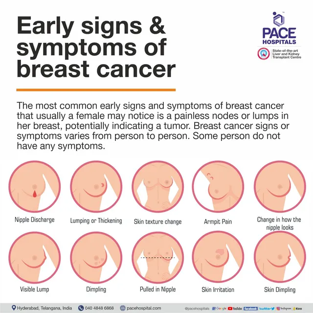
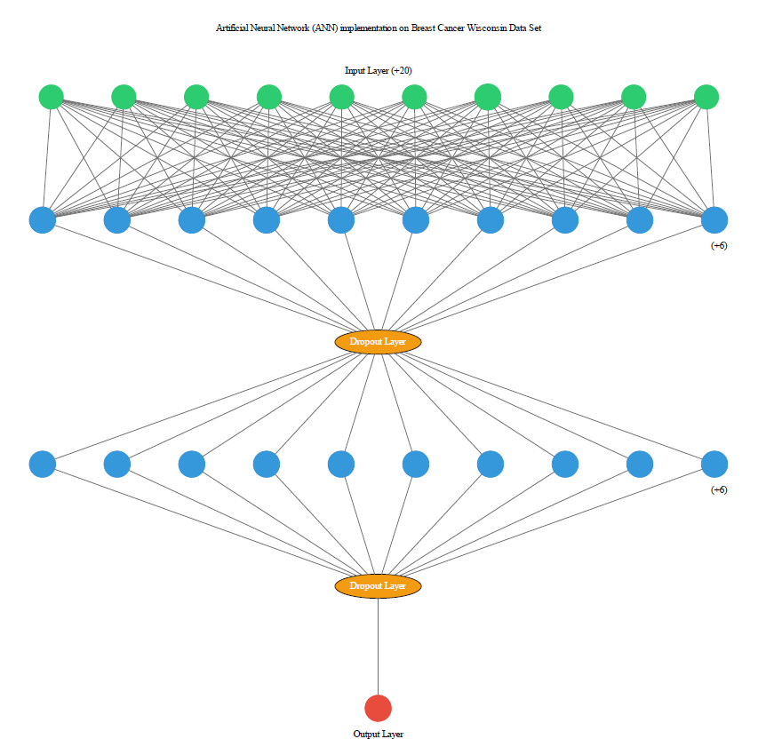

# Breast Cancer Prediction using Simple Multilayer Perceptron Neural Network (Feed Forward Model)

[](https://opensource.org/licenses/MIT)


## Overview

This project involves predicting breast cancer using a simple multilayer perceptron neural network (feed-forward model). The dataset used for this project is the Breast Cancer Wisconsin (Diagnostic) Dataset, which is a well-known dataset for breast cancer classification.

## Developer Information

**Developer:** Yuvraj Singh Chowdhary

**Contact:** [LinkedIn Profile](https://www.linkedin.com/in/yuvraj-singh-chowdhary/)

## Project Report

You can view the detailed project report [here](https://www.canva.com/design/DAGIHev6_gE/iTzHPPaV3fkjKvmvJkS1ag/view).


## Table of Contents

- [Overview](#overview)
- [Dataset](#dataset)
- [Installation](#installation)
- [Usage](#usage)
- [Results](#results)
- [Contributing](#contributing)
- [License](#license)

## Dataset

The Breast Cancer Wisconsin (Diagnostic) Dataset is used for this project. It contains 569 samples of malignant and benign tumor cells. The dataset features are computed from a digitized image of a fine needle aspirate (FNA) of a breast mass. They describe the characteristics of the cell nuclei present in the image.

- **Features:**
  - Mean radius
  - Mean texture
  - Mean perimeter
  - Mean area
  - Mean smoothness
  - Mean compactness
  - Mean concavity
  - Mean concave points
  - Mean symmetry
  - Mean fractal dimension
  - etc.

- **Target:**
  - 0: Malignant
  - 1: Benign
 
  - 

## Installation

To run this project, you will need Python and several libraries. You can install the necessary libraries using the following commands:

```bash
pip install numpy pandas matplotlib scikit-learn seaborn
```

## Usage

1. **Import Libraries**

    Import the necessary libraries for data manipulation, visualization, and machine learning.

    ```python
    import numpy as np
    import pandas as pd
    import matplotlib.pyplot as plt
    import sklearn.datasets
    from sklearn.model_selection import train_test_split
    import seaborn as sns
    ```

2. **Load Dataset**

    Load the breast cancer dataset from sklearn.

    ```python
    breast_cancer_dataset = sklearn.datasets.load_breast_cancer()
    ```

3. **Create DataFrame**

    Create a DataFrame from the dataset and add the target column.

    ```python
    data_frame = pd.DataFrame(breast_cancer_dataset.data, columns = breast_cancer_dataset.feature_names)
    data_frame['label'] = breast_cancer_dataset.target
    ```

4. **Data Preprocessing**

    - Check for null values
    - Display statistical measures
    - Check distribution of target variable

    ```python
    data_frame.isnull().sum()
    data_frame.describe()
    data_frame['label'].value_counts()
    ```

5. **Split Data**

    Split the data into features (X) and target (Y), then into training and test sets.

    ```python
    X = data_frame.drop(columns='label', axis=1)
    Y = data_frame['label']
    X_train, X_test, Y_train, Y_test = train_test_split(X, Y, test_size=0.2, random_state=2)
    ```

6. **Feature Scaling**

    Scale the features using StandardScaler.

    ```python
    from sklearn.preprocessing import StandardScaler
    scaler = StandardScaler()
    X_train_std = scaler.fit_transform(X_train)
    X_test_std = scaler.transform(X_test)
    ```

7. **Build and Train Model**

    Build and train a multilayer perceptron neural network model.

    ```python
    model = keras.Sequential([
                          keras.layers.Flatten(input_shape=(30,)),
                          keras.layers.Dense(20, activation='relu'),
                          keras.layers.Dense(2, activation='sigmoid')
    ])
    model.compile(optimizer='adam',
              loss='sparse_categorical_crossentropy',
              metrics=['accuracy'])
    history = model.fit(X_train_std, Y_train, validation_split=0.1, epochs=10)
    
    ```

    

8. **Evaluate Model**

    Evaluate the performance of the model.

    ```python
    loss, accuracy = model.evaluate(X_test_std, Y_test)
    print(accuracy,loss)

    ```

## Results

- After training the Multi Perceptron Model with 10 epochs, we achieved an accuracy of 95% on the test dataset.

 

## Contributing

If you want to contribute to this project, please fork the repository and create a pull request. For major changes, please open an issue first to discuss what you would like to change.

 


## License

This project is licensed under the MIT License. See the [LICENSE](LICENSE) file for more details.

---

